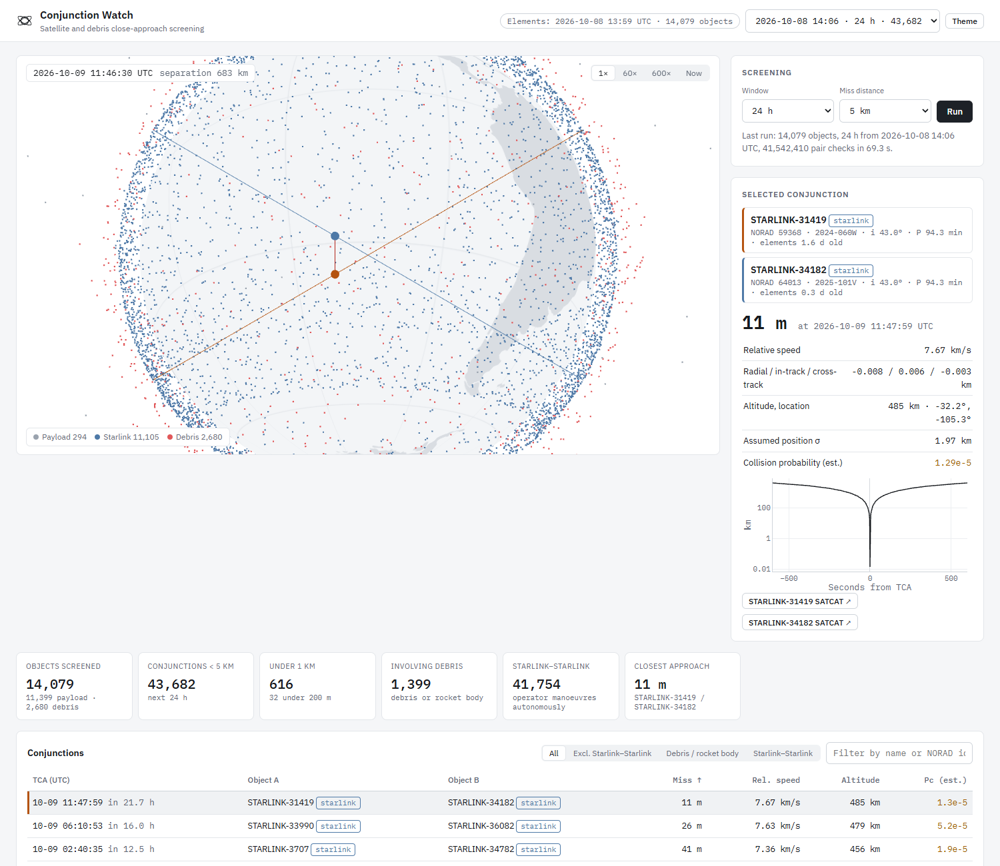

# Conjunction Watch

Screens every tracked satellite and debris object against every other one and lists the close
approaches coming up in the next hours, with a 3D view of each encounter.



## Usage

```bash
./run.sh        # Linux / macOS / WSL
run.bat         # Windows
```

Open http://localhost:8001. A 24-hour screening starts automatically on first launch.

- Click any dot on the globe, or search any object by name or NORAD id (ISS, Hubble, Tiangong, Starlink-1008…) to highlight it, follow it and
  list its upcoming close approaches. Links like `http://localhost:8001/#track=ISS,Hubble` open with objects tracked.
- Esc, the "Clear all" button or the × on a chip removes highlights; clicking a tracked dot again untracks it.
- Time controls: play / pause, ±10 min, time warp from −3600× to 3600×, and a timeline across the screening window.
- Click a conjunction to replay the encounter on the globe.

## How it works

1. Downloads orbital elements from CelesTrak: active satellites plus the Cosmos 2251, Iridium 33,
   Fengyun-1C and Cosmos 1408 debris clouds. Data is cached, since CelesTrak updates it every 2 hours.
2. Propagates all objects with SGP4 on a 20-second grid.
3. At each step a k-d tree finds pairs close enough to possibly meet before the next step.
   Closest approach is estimated from relative motion, then refined with direct SGP4 calls.
4. Each event gets the miss distance, relative speed, radial / in-track / cross-track offsets,
   altitude, location and a rough collision probability.

A 24-hour run over ~14,000 objects takes about a minute.

## Building a track record

There is no discovery credit for close approaches (operators get official warnings from the US Space Force),
but predictions can be published and checked:

1. Publish a run's closest approaches on Zenodo before they happen. The DOI timestamps the prediction.
2. After closest approach, "Check outcomes" compares the element sets used for the prediction with the first
   ones published afterwards. An unexplained orbit change (more than 300 m in semi-major axis beyond the
   drag trend, or 0.01° in inclination) is reported as a likely avoidance manoeuvre.
3. Publish the outcomes, linked to the predictions DOI.

Each conjunction can also be exported as a CDM (CCSDS conjunction data message), with a drafted email to the
operator and a short post.

## Limitations

- Element sets (TLEs) are accurate to roughly a kilometre, and the error grows with age, so sub-kilometre
  miss distances are indicative only.
- Collision probability uses an assumed position uncertainty. Real covariance data is not public.
- Starlink satellites manoeuvre autonomously, so most Starlink–Starlink events will not happen as predicted.
- Only objects in CelesTrak's public groups are included, not the full catalogue.
